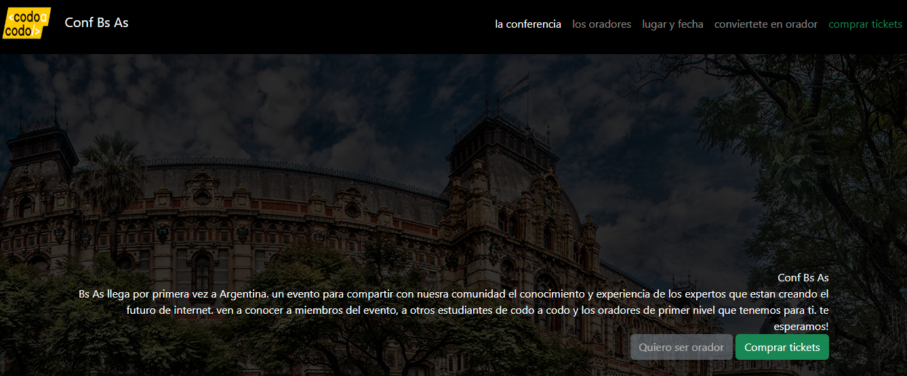

Conferencia sobre Tecnología: es una aplicación web que permite a los usuarios comprar tickets para un evento o registrarse como oradores en una conferencia. El sistema ofrece funcionalidades avanzadas como el cálculo y aplicación de descuentos, así como la gestión completa de oradores (agregar, modificar y eliminar).

Tecnologías usadas:
Frontend: HTML, CSS, JavaScript.
Backend: Java (JPA web)
Base de datos: MySQL (local).

Este proyecto fue mi primera experiencia con el lenguaje de programacion Java, utilice y conoci la clase servlet, connection y la conexion a una base de datos local, me permitio disfrutar de lo que ofrece un lenguaje como Java, ademas de conocer, formar parte de una comidad de desarrolladores principiantes y colaborar con otros. Me dio la satisfaccion de desarrollar mi primera aplicacion web.

Instalación
Sigue estos pasos para clonar el repositorio y ejecutar la aplicación localmente:

# Clonar el repositorio
git clone https://github.com/Jwruiz/projJS.git

Una vez que la aplicación esté corriendo:

Comprar tickets: Dirígete a la sección de tickets, selecciona el número de entradas y aplica cualquier código de descuento.
Registro de oradores: Puedes agregar, modificar o eliminar oradores desde la sección "Administración de Oradores".

Licencia
Jeheremi Ruiz
